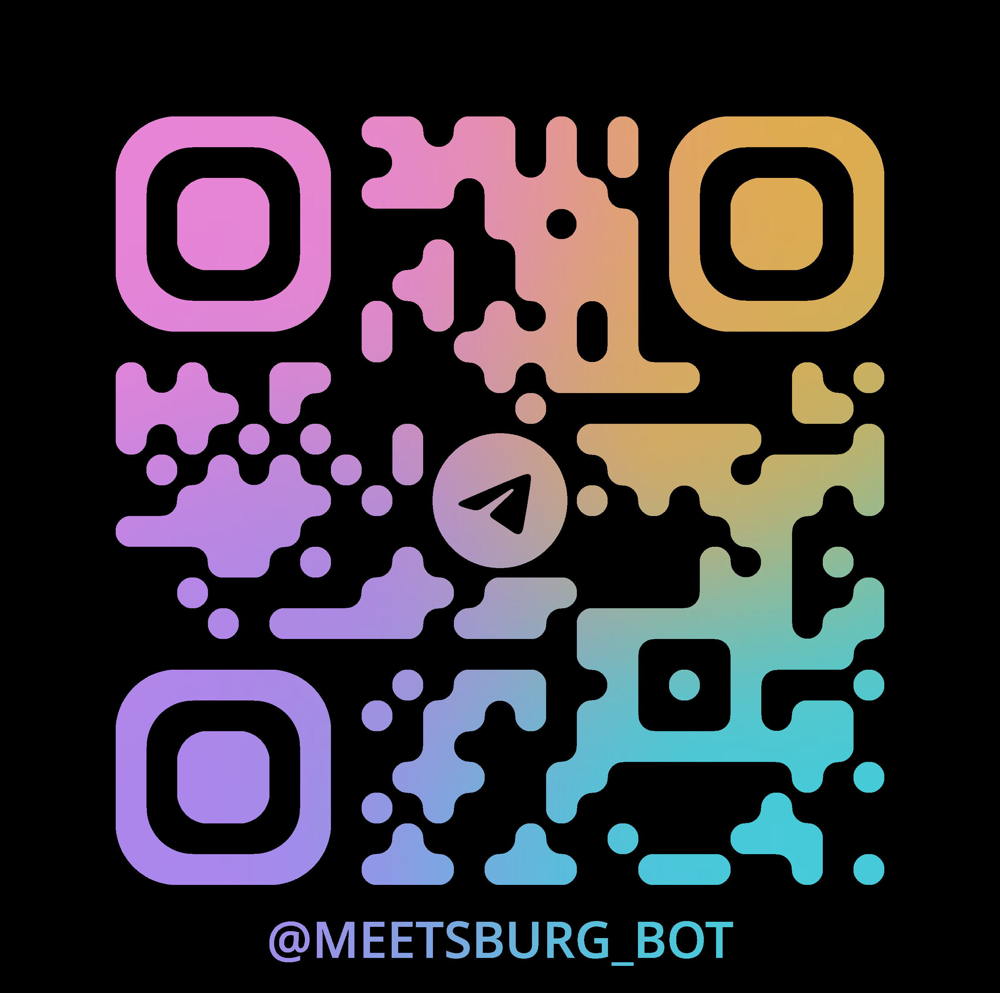

# Запуск
Для запуска со своего компьютера, потребуется `conf.json` файл лежащий в корне приложения со следующей структурой:
```json
{
    "token": "<your-telegram-token>"
}
```
# Где найти?
`@meetsburg_bot` или по QR:
